# 系统架构设计文档 - 冷钢碳排放AI智慧管理平台

**文档版本**：V1.0
**编写日期**：2026年5月12日
**编写人**：高见远（系统架构师）
**状态**：初稿

---

## 1. 系统架构概览

### 1.1 整体架构图

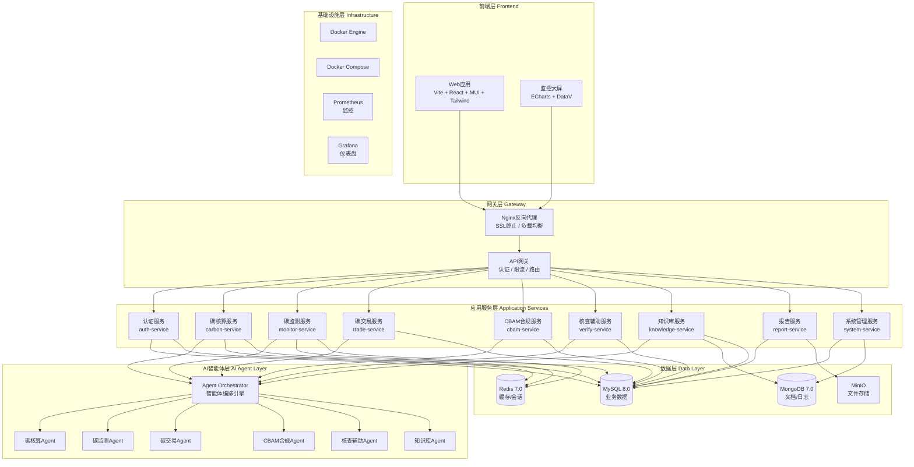

### 1.2 技术选型说明

| 层级 | 技术 | 选型理由 |
|------|------|---------|
| **前端框架** | React 18 + TypeScript | 组件化开发、生态成熟、类型安全，适合企业级应用 |
| **前端构建** | Vite 5 | 开发体验优秀、HMR快速、构建性能优异 |
| **UI组件库** | MUI 5 + Tailwind CSS | MUI提供高质量企业级组件，Tailwind补充灵活样式 |
| **图表库** | ECharts 5 | 工业级数据可视化、图表类型丰富、性能优异 |
| **后端主服务** | Node.js 20 + Express | 异步IO适合高并发、与前端共享TypeScript生态 |
| **AI推理服务** | Python 3.11 + FastAPI | AI/ML生态完善、FastAPI高性能异步框架 |
| **AI框架** | LangChain + 自研Agent框架 | LangChain成熟的多Agent编排能力，自研框架适配业务 |
| **关系数据库** | MySQL 8.0 | 事务一致性、成熟稳定、运维经验丰富 |
| **缓存** | Redis 7.0 | 会话管理、热数据缓存、排行榜、发布订阅 |
| **文档数据库** | MongoDB 7.0 | 知识库文档存储、日志存储、Schema灵活 |
| **对象存储** | MinIO | S3兼容、私有化部署、文件/报告存储 |
| **容器化** | Docker + Docker Compose | 标准化部署、环境一致、运维简化 |
| **监控** | Prometheus + Grafana | 开源标准、生态完善、告警灵活 |

### 1.3 系统边界与职责划分

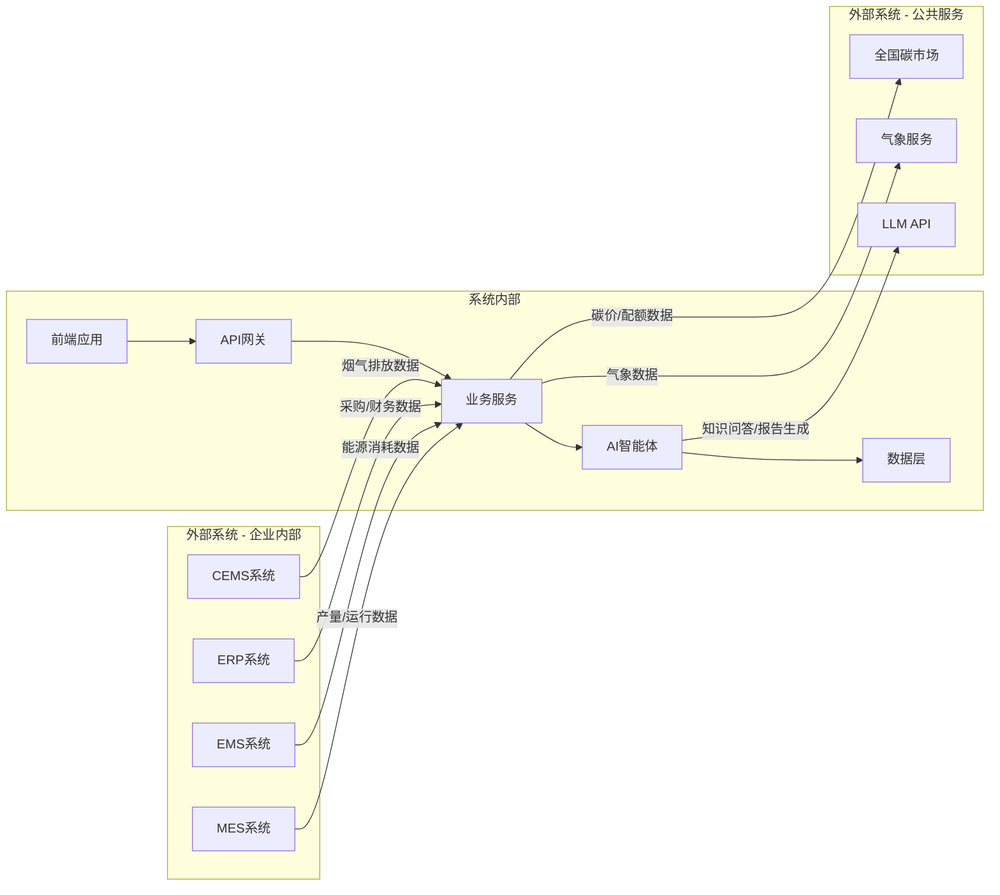

**系统内部职责**：
- 前端应用：用户交互、数据展示、表单录入
- API网关：认证鉴权、限流熔断、请求路由、日志记录
- 业务服务：业务逻辑处理、数据CRUD、事务管理
- AI智能体：AI推理、多Agent协作、知识检索、报告生成
- 数据层：数据持久化、缓存、文件存储

**系统外部边界**：
- 企业内部系统（MES/EMS/ERP/CEMS）通过Data Adapter适配器接入
- 外部公共服务通过API Client封装调用
- 外部系统对接采用异步+降级策略，外部不可用不影响核心功能

---

## 2. 功能模块设计

### 2.1 模块划分

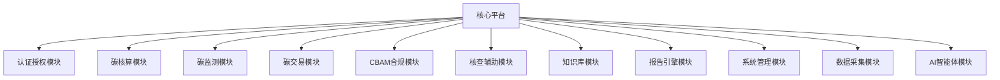

### 2.2 各模块职责说明

| 模块 | 服务 | 职责 | 对应PRD需求 |
|------|------|------|-------------|
| **认证授权** | auth-service | 用户认证(JWT)、角色权限(RBAC)、会话管理 | FR-P0-005 |
| **碳核算** | carbon-service | 活动数据管理、排放因子管理、碳排放计算引擎、工序级分解 | FR-P0-001 |
| **碳监测** | monitor-service | 实时监控、大屏数据、异常预警、CEMS比对 | FR-P0-002, FR-P1-001 |
| **碳交易** | trade-service | 配额台账、履约跟踪、碳价跟踪、策略建议 | FR-P0-003 |
| **CBAM合规** | cbam-service | CBAM规则管理、隐含碳计算、申报文件生成 | FR-P1-002 |
| **核查辅助** | verify-service | MRV检查、数据预审、资料包生成 | FR-P1-003 |
| **知识库** | knowledge-service | 文档管理、向量化存储、智能问答、政策追踪 | FR-P0-004 |
| **报告引擎** | report-service | 模板管理、PDF报告生成、数据导出 | 各模块报告需求 |
| **系统管理** | system-service | 用户管理、角色管理、数据字典、审计日志 | FR-P0-005 |
| **数据采集** | data-adapter-service | 外部系统对接、Excel导入、数据校验 | 数据输入接口 |
| **AI智能体** | agent-service | Agent编排、工具调用、多Agent协作 | AI功能需求 |

### 2.3 模块间依赖关系

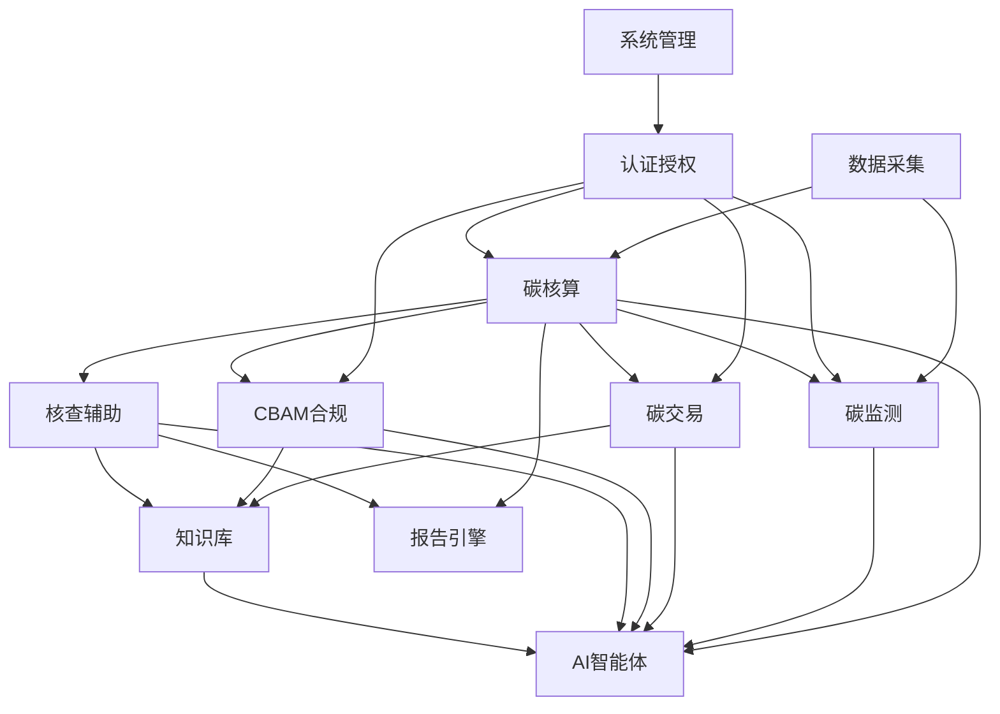

**关键依赖说明**：
- **碳核算**是核心基础模块，监测、交易、CBAM、核查均依赖核算结果
- **AI智能体**被多个模块调用，通过统一编排引擎提供能力
- **知识库**为CBAM、核查、交易提供知识支撑
- **报告引擎**为碳核算和核查辅助提供报告生成能力
- **认证授权**是横切关注点，所有业务模块均依赖

---

## 3. 数据模型设计

### 3.1 核心实体

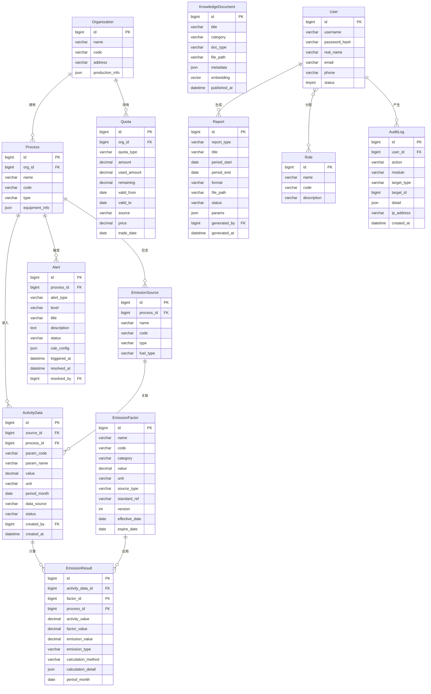

### 3.2 数据字典

#### 3.2.1 活动数据表 (activity_data)

| 字段名 | 类型 | 必填 | 说明 |
|--------|------|------|------|
| id | BIGINT AUTO_INCREMENT | Y | 主键 |
| source_id | BIGINT | Y | 排放源ID |
| process_id | BIGINT | Y | 工序ID |
| param_code | VARCHAR(32) | Y | 参数代码(如AL-1) |
| param_name | VARCHAR(128) | Y | 参数名称(如焦炭消耗量) |
| value | DECIMAL(18,4) | Y | 数值 |
| unit | VARCHAR(32) | Y | 单位(吨/万m³/万kWh) |
| period_month | DATE | Y | 数据所属月份 |
| data_source | VARCHAR(32) | Y | 数据来源(MANUAL/EXCEL/EMS/CEMS) |
| status | VARCHAR(16) | Y | 状态(DRAFT/SUBMITTED/VERIFIED) |
| remark | VARCHAR(512) | N | 备注 |
| created_by | BIGINT | Y | 创建人 |
| created_at | DATETIME | Y | 创建时间 |
| updated_at | DATETIME | Y | 更新时间 |

#### 3.2.2 排放因子表 (emission_factor)

| 字段名 | 类型 | 必填 | 说明 |
|--------|------|------|------|
| id | BIGINT AUTO_INCREMENT | Y | 主键 |
| name | VARCHAR(128) | Y | 因子名称 |
| code | VARCHAR(32) | Y | 因子编码 |
| category | VARCHAR(32) | Y | 类别(FUEL/PROCESS/ELECTRICITY) |
| value | DECIMAL(18,6) | Y | 因子值 |
| unit | VARCHAR(64) | Y | 单位(如tCO₂/TJ) |
| source_type | VARCHAR(16) | Y | 来源(NATIONAL/INDUSTRY/CUSTOM/DEFAULT) |
| standard_ref | VARCHAR(128) | N | 标准引用 |
| version | INT | Y | 版本号 |
| effective_date | DATE | Y | 生效日期 |
| expire_date | DATE | N | 失效日期 |
| lower_heating_value | DECIMAL(18,6) | N | 低位发热量 |
| carbon_content | DECIMAL(18,6) | N | 含碳量 |
| oxidation_rate | DECIMAL(6,4) | N | 氧化率 |
| created_at | DATETIME | Y | 创建时间 |

#### 3.2.3 碳排放结果表 (emission_result)

| 字段名 | 类型 | 必填 | 说明 |
|--------|------|------|------|
| id | BIGINT AUTO_INCREMENT | Y | 主键 |
| activity_data_id | BIGINT | Y | 活动数据ID |
| factor_id | BIGINT | Y | 排放因子ID |
| process_id | BIGINT | Y | 工序ID |
| activity_value | DECIMAL(18,4) | Y | 活动数据值 |
| factor_value | DECIMAL(18,6) | Y | 排放因子值 |
| emission_value | DECIMAL(18,4) | Y | 排放量(tCO₂) |
| emission_type | VARCHAR(32) | Y | 排放类型(FUEL/PROCESS/ELECTRICITY) |
| calculation_method | VARCHAR(32) | Y | 计算方法 |
| calculation_detail | JSON | Y | 计算过程明细 |
| period_month | DATE | Y | 核算月份 |
| created_at | DATETIME | Y | 创建时间 |

#### 3.2.4 碳配额表 (quota)

| 字段名 | 类型 | 必填 | 说明 |
|--------|------|------|------|
| id | BIGINT AUTO_INCREMENT | Y | 主键 |
| org_id | BIGINT | Y | 企业ID |
| quota_type | VARCHAR(32) | Y | 类型(FREE/AUCTION/CCER) |
| amount | DECIMAL(18,4) | Y | 配额数量 |
| used_amount | DECIMAL(18,4) | Y | 已使用量 |
| remaining | DECIMAL(18,4) | Y | 剩余量 |
| valid_from | DATE | Y | 有效期起始 |
| valid_to | DATE | Y | 有效期截止 |
| source | VARCHAR(64) | N | 来源说明 |
| price | DECIMAL(18,4) | N | 成交价格(元/吨) |
| trade_date | DATE | N | 交易日期 |
| batch_no | VARCHAR(32) | N | 批次号 |
| created_at | DATETIME | Y | 创建时间 |
| updated_at | DATETIME | Y | 更新时间 |

#### 3.2.5 预警表 (alert)

| 字段名 | 类型 | 必填 | 说明 |
|--------|------|------|------|
| id | BIGINT AUTO_INCREMENT | Y | 主键 |
| process_id | BIGINT | N | 关联工序ID |
| alert_type | VARCHAR(32) | Y | 预警类型(THRESHOLD/TREND/YOY/AI_PREDICT) |
| level | VARCHAR(16) | Y | 级别(BLUE/YELLOW/RED) |
| title | VARCHAR(256) | Y | 预警标题 |
| description | TEXT | Y | 预警描述 |
| status | VARCHAR(16) | Y | 状态(PENDING/PROCESSING/RESOLVED/CLOSED) |
| rule_config | JSON | Y | 触发规则配置 |
| triggered_at | DATETIME | Y | 触发时间 |
| resolved_at | DATETIME | N | 处理时间 |
| resolved_by | BIGINT | N | 处理人 |
| resolution | TEXT | N | 处置说明 |
| created_at | DATETIME | Y | 创建时间 |

#### 3.2.6 知识库文档表 (knowledge_document)

| 字段名 | 类型 | 必填 | 说明 |
|--------|------|------|------|
| id | BIGINT AUTO_INCREMENT | Y | 主键 |
| title | VARCHAR(256) | Y | 文档标题 |
| category | VARCHAR(32) | Y | 分类(POLICY/STANDARD/GUIDE/ENTERPRISE) |
| doc_type | VARCHAR(16) | Y | 类型(PDF/DOCX/XLSX) |
| file_path | VARCHAR(512) | Y | 存储路径 |
| content_text | LONGTEXT | N | 解析后文本 |
| embedding_id | VARCHAR(128) | N | 向量存储ID |
| metadata | JSON | N | 元数据(标准号/发布日期/适用范围等) |
| published_at | DATETIME | N | 发布日期 |
| created_at | DATETIME | Y | 创建时间 |

#### 3.2.7 报告表 (report)

| 字段名 | 类型 | 必填 | 说明 |
|--------|------|------|------|
| id | BIGINT AUTO_INCREMENT | Y | 主键 |
| report_type | VARCHAR(32) | Y | 类型(MONTHLY/ANNUAL/CBAM/VERIFY) |
| title | VARCHAR(256) | Y | 报告标题 |
| period_start | DATE | Y | 报告期起始 |
| period_end | DATE | Y | 报告期截止 |
| format | VARCHAR(16) | Y | 格式(PDF/EXCEL/ZIP) |
| file_path | VARCHAR(512) | N | 文件存储路径 |
| status | VARCHAR(16) | Y | 状态(GENERATING/COMPLETED/FAILED) |
| params | JSON | N | 生成参数 |
| generated_by | BIGINT | Y | 生成人 |
| generated_at | DATETIME | N | 生成时间 |

### 3.3 数据库分库策略

| 数据库 | 存储内容 | 说明 |
|--------|---------|------|
| **MySQL - carbon_main** | 用户、角色、组织、工序、排放源、活动数据、排放因子、排放结果、配额、预警 | 核心业务数据，要求事务一致性 |
| **MySQL - carbon_report** | 报告记录、报告模板 | 报告相关数据，与主库分离降低主库压力 |
| **Redis** | 会话(token)、缓存(首页仪表盘)、限流计数器、实时监控数据 | 热数据缓存、实时数据 |
| **MongoDB - carbon_knowledge** | 知识库文档、向量索引、对话历史、审计日志 | 文档型数据、非结构化数据 |
| **MinIO** | Excel导入文件、PDF报告、核查资料包、知识库原始文件 | 文件对象存储 |

---

## 4. AI智能体设计

### 4.1 Agent架构

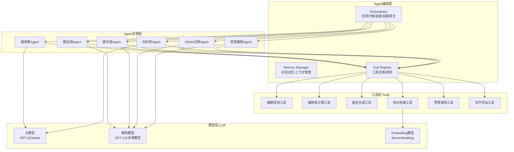

### 4.2 各Agent详细设计

#### 4.2.1 碳核算Agent (CarbonAccountingAgent)

**职责**：自动执行碳排放核算计算，生成核算结果和报告

**核心能力**：
- 接收活动数据，自动匹配排放因子
- 按排放类型（燃料/过程/电力）分别计算
- 工序级碳排放分解
- 计算过程可追溯记录

**工具依赖**：
| 工具 | 说明 |
|------|------|
| query_activity_data | 查询活动数据 |
| query_emission_factor | 查询排放因子 |
| calculate_fuel_emission | 化石燃料排放计算 |
| calculate_process_emission | 过程排放计算 |
| calculate_electricity_emission | 电力排放计算 |
| save_emission_result | 保存核算结果 |
| generate_report | 生成核算报告 |

**Prompt模板**：
```
你是一个专业的碳排放核算智能体。你需要根据提供的活动数据和排放因子，按照GB/T 32150-2025标准计算碳排放量。

计算规则：
1. 化石燃料燃烧排放：E = Σ(AD_i × NCV_i × CC_i × OF_i × 44/12)
2. 过程排放：E = Σ(AD_j × EF_j)
3. 净购入电力排放：E = AD_电力 × EF_电网

请按步骤执行计算，每步记录中间结果。
```

#### 4.2.2 碳监测Agent (CarbonMonitorAgent)

**职责**：实时监控碳排放数据，检测异常并预警

**核心能力**：
- 实时碳排放趋势分析
- 多规则异常检测（阈值/趋势/同比/AI预测）
- 预警分级与通知
- CEMS数据比对

**工具依赖**：
| 工具 | 说明 |
|------|------|
| query_realtime_data | 查询实时排放数据 |
| query_historical_data | 查询历史数据 |
| check_threshold | 阈值检测 |
| check_trend | 趋势分析 |
| check_yoy | 同比分析 |
| create_alert | 创建预警 |
| notify_user | 发送通知 |

#### 4.2.3 碳交易Agent (CarbonTradeAgent)

**职责**：配额管理、履约策略分析、碳价跟踪

**核心能力**：
- 配额缺口/盈余自动计算
- 履约策略推荐（买入/卖出时机）
- 碳价趋势分析与预警
- CCER抵消比例优化

**工具依赖**：
| 工具 | 说明 |
|------|------|
| query_quota | 查询配额数据 |
| query_carbon_price | 查询碳价数据 |
| calculate_compliance | 计算履约状态 |
| analyze_strategy | 策略分析 |
| query_knowledge | 知识库检索 |

#### 4.2.4 CBAM合规Agent (CBAMComplianceAgent)

**职责**：CBAM规则解读、隐含碳计算、申报文件生成

**核心能力**：
- CBAM规则解读与政策追踪
- 按钢材品种计算隐含碳排放量
- CBAM申报文件自动生成
- CBAM证书成本预估

**工具依赖**：
| 工具 | 说明 |
|------|------|
| query_cbam_rules | 查询CBAM规则 |
| calculate_embedded_carbon | 计算隐含碳 |
| query_export_data | 查询出口数据 |
| generate_cbam_report | 生成CBAM报告 |
| query_knowledge | 知识库检索 |

#### 4.2.5 核查辅助Agent (VerificationAssistantAgent)

**职责**：辅助核查准备，数据预审，资料包生成

**核心能力**：
- MRV体系完整性检查
- 数据交叉验证与一致性检查
- 核查问题预判与回答建议
- 资料包自动归档

**工具依赖**：
| 工具 | 说明 |
|------|------|
| check_mrv_completeness | MRV完整性检查 |
| validate_data_consistency | 数据一致性验证 |
| query_verification_history | 查询核查历史 |
| generate_material_package | 生成资料包 |
| query_knowledge | 知识库检索 |

#### 4.2.6 知识库Agent (KnowledgeBaseAgent)

**职责**：政策法规智能问答、标准规范检索

**核心能力**：
- RAG（检索增强生成）智能问答
- 多轮对话与追问
- 政策更新追踪与影响分析
- 标准适用性判断

**工具依赖**：
| 工具 | 说明 |
|------|------|
| search_knowledge | 知识库语义检索 |
| search_by_keyword | 关键词检索 |
| get_document_detail | 获取文档详情 |
| analyze_policy_impact | 政策影响分析 |
| generate_answer | 生成回答 |

### 4.3 Agent协作流程

#### 4.3.1 碳核算全流程（多Agent协作）

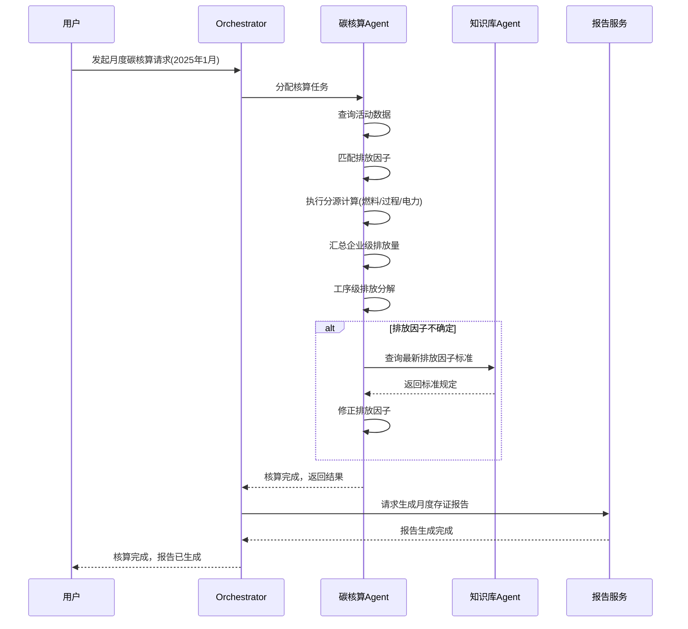

#### 4.3.2 CBAM合规流程（多Agent协作）

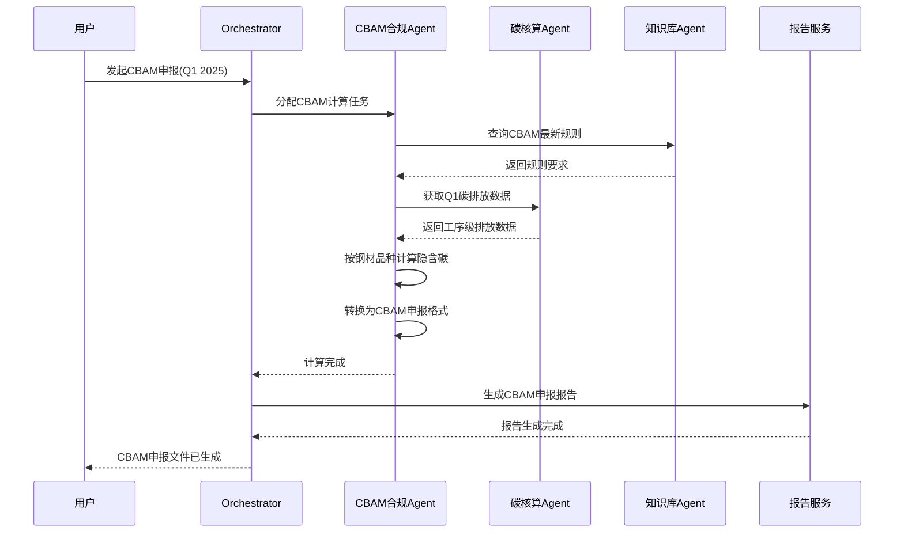

#### 4.3.3 核查辅助流程（多Agent协作）

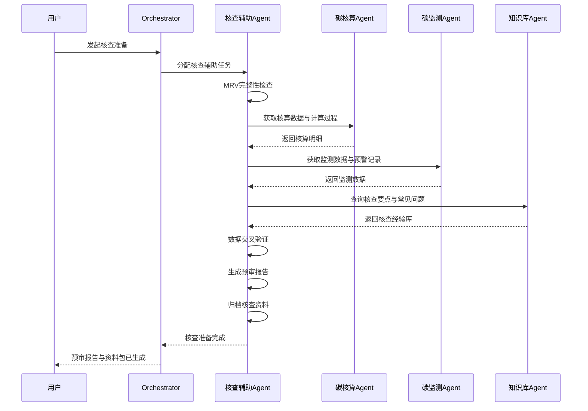

---

## 5. API接口规范

### 5.1 接口概览

| 模块 | 基础路径 | 核心接口数 |
|------|---------|-----------|
| 认证授权 | /api/v1/auth | 5 |
| 碳核算 | /api/v1/carbon | 15 |
| 碳监测 | /api/v1/monitor | 10 |
| 碳交易 | /api/v1/trade | 10 |
| CBAM合规 | /api/v1/cbam | 8 |
| 核查辅助 | /api/v1/verify | 6 |
| 知识库 | /api/v1/knowledge | 8 |
| 报告 | /api/v1/report | 6 |
| 系统管理 | /api/v1/system | 12 |

### 5.2 核心接口定义

#### 5.2.1 认证接口

**POST /api/v1/auth/login**
```
Request:
{
  "username": "string",
  "password": "string"
}

Response:
{
  "code": 200,
  "data": {
    "token": "eyJhbGciOiJIUzI1NiIs...",
    "expiresIn": 86400,
    "user": {
      "id": 1,
      "username": "zhangsan",
      "realName": "张三",
      "roles": ["carbon_manager"]
    }
  }
}
```

**POST /api/v1/auth/logout**
```
Headers: Authorization: Bearer <token>

Response:
{
  "code": 200,
  "message": "logout success"
}
```

#### 5.2.2 碳核算接口

**POST /api/v1/carbon/activity-data/import**
```
Content-Type: multipart/form-data

Request:
- file: Excel文件(.xlsx)
- periodMonth: "2025-01"
- processId: 1

Response:
{
  "code": 200,
  "data": {
    "totalRows": 150,
    "successRows": 148,
    "failedRows": 2,
    "errors": [
      {"row": 23, "message": "数值超出合理范围"},
      {"row": 67, "message": "单位不匹配"}
    ]
  }
}
```

**GET /api/v1/carbon/activity-data**
```
Query Params:
- processId: 工序ID (可选)
- periodMonth: 月份 (必填, 格式YYYY-MM)
- paramCode: 参数代码 (可选)
- page: 页码 (默认1)
- pageSize: 每页条数 (默认20)

Response:
{
  "code": 200,
  "data": {
    "total": 48,
    "list": [
      {
        "id": 1,
        "paramCode": "AL-1",
        "paramName": "焦炭消耗量",
        "value": 775092.54,
        "unit": "吨",
        "periodMonth": "2025-01",
        "dataSource": "EXCEL",
        "status": "SUBMITTED"
      }
    ]
  }
}
```

**POST /api/v1/carbon/calculate**
```
Request:
{
  "periodMonth": "2025-01",
  "processIds": [1, 2, 3, 4],
  "calculationMethod": "STANDARD"
}

Response:
{
  "code": 200,
  "data": {
    "periodMonth": "2025-01",
    "totalEmission": 309331.75,
    "unit": "tCO₂",
    "breakdown": {
      "fuel": 274002.33,
      "process": 19174.50,
      "electricity": 16154.92
    },
    "byProcess": [
      {
        "processId": 1,
        "processName": "烧结",
        "emission": 82500.00,
        "intensity": 0.0
      },
      {
        "processId": 2,
        "processName": "炼铁",
        "emission": 165000.00,
        "intensity": 0.0
      }
    ],
    "calculationId": "calc_202501_001"
  }
}
```

**GET /api/v1/carbon/emission-result/summary**
```
Query Params:
- periodStart: 起始月份 (必填)
- periodEnd: 截止月份 (必填)
- processId: 工序ID (可选)
- groupBy: 分组维度 (MONTH/PROCESS/SOURCE, 默认MONTH)

Response:
{
  "code": 200,
  "data": {
    "totalEmission": 3711981.00,
    "unit": "tCO₂",
    "groups": [
      {
        "key": "2025-01",
        "fuel": 274002.33,
        "process": 19174.50,
        "electricity": 16154.92,
        "total": 309331.75
      }
    ],
    "intensity": {
      "perTonSteel": 1.97,
      "unit": "tCO₂/t钢"
    }
  }
}
```

#### 5.2.3 碳监测接口

**GET /api/v1/monitor/dashboard**
```
Query Params:
- periodMonth: 月份 (可选，默认当月)

Response:
{
  "code": 200,
  "data": {
    "yearlyTotal": 1234567.89,
    "yearlyTarget": 3711981.00,
    "monthlyEmission": 309331.75,
    "lastMonthEmission": 315000.00,
    "intensity": 1.97,
    "emissionStructure": {
      "fuel": 274002.33,
      "process": 19174.50,
      "electricity": 16154.92
    },
    "processRanking": [
      {"processId": 2, "name": "炼铁", "emission": 165000.00},
      {"processId": 1, "name": "烧结", "emission": 82500.00}
    ],
    "recentAlerts": [
      {"id": 1, "level": "YELLOW", "title": "高炉煤气排放偏高"}
    ]
  }
}
```

**GET /api/v1/monitor/alerts**
```
Query Params:
- level: 预警级别 (可选)
- status: 状态 (可选)
- startDate: 起始日期 (可选)
- endDate: 截止日期 (可选)
- page: 页码
- pageSize: 每页条数

Response:
{
  "code": 200,
  "data": {
    "total": 15,
    "list": [
      {
        "id": 1,
        "alertType": "THRESHOLD",
        "level": "YELLOW",
        "title": "4#高炉CO₂排放超过日均值15%",
        "status": "PENDING",
        "triggeredAt": "2025-01-15T10:30:00Z"
      }
    ]
  }
}
```

#### 5.2.4 碳交易接口

**GET /api/v1/trade/quota/summary**
```
Response:
{
  "code": 200,
  "data": {
    "totalAllocated": 3500000.00,
    "totalUsed": 2800000.00,
    "remaining": 700000.00,
    "ccerOffset": 50000.00,
    "complianceStatus": "GREEN",
    "complianceDeadline": "2025-12-31",
    "daysRemaining": 280,
    "estimatedCost": 49000000.00,
    "currentPrice": 70.00
  }
}
```

#### 5.2.5 知识库接口

**POST /api/v1/knowledge/ask**
```
Request:
{
  "question": "钢铁企业碳排放核算应采用哪个标准？",
  "conversationId": "conv_001"
}

Response:
{
  "code": 200,
  "data": {
    "answer": "钢铁生产企业碳排放核算应采用GB/T 32151.5-2026《温室气体排放核算与报告要求 第5部分：钢铁生产企业》，同时参考GB/T 32150-2025《工业企业温室气体排放核算和报告通则》。",
    "sources": [
      {
        "documentId": 12,
        "title": "GB/T 32151.5-2026",
        "relevance": 0.95,
        "excerpt": "..."
      }
    ],
    "conversationId": "conv_001"
  }
}
```

#### 5.2.6 报告接口

**POST /api/v1/report/generate**
```
Request:
{
  "reportType": "MONTHLY",
  "periodStart": "2025-01-01",
  "periodEnd": "2025-01-31",
  "format": "PDF",
  "params": {
    "includeProcessDetail": true,
    "includeComparison": true
  }
}

Response:
{
  "code": 200,
  "data": {
    "reportId": "rpt_202501_001",
    "status": "GENERATING",
    "estimatedTime": 600
  }
}
```

**GET /api/v1/report/{reportId}/download**
```
Response: 文件流 (application/pdf)
```

### 5.3 数据格式

#### 5.3.1 统一响应格式

```typescript
interface ApiResponse<T> {
  code: number;        // 200成功, 4xx客户端错误, 5xx服务端错误
  message: string;     // 错误描述
  data: T;             // 业务数据
  timestamp: string;   // ISO 8601时间戳
  traceId: string;     // 请求追踪ID
}
```

#### 5.3.2 分页响应格式

```typescript
interface PageResponse<T> {
  code: number;
  data: {
    total: number;
    page: number;
    pageSize: number;
    list: T[];
  };
  timestamp: string;
  traceId: string;
}
```

#### 5.3.3 错误码规范

| 错误码 | 说明 |
|--------|------|
| 200 | 成功 |
| 400 | 请求参数错误 |
| 401 | 未授权（Token无效或过期） |
| 403 | 无权限访问该资源 |
| 404 | 资源不存在 |
| 409 | 数据冲突（如重复提交） |
| 422 | 数据校验失败 |
| 429 | 请求过于频繁（限流） |
| 500 | 服务器内部错误 |
| 503 | AI服务暂时不可用 |

---

## 6. 任务分解与文件列表

### 6.1 实现顺序

项目分三个阶段实施，每个阶段按以下顺序推进：

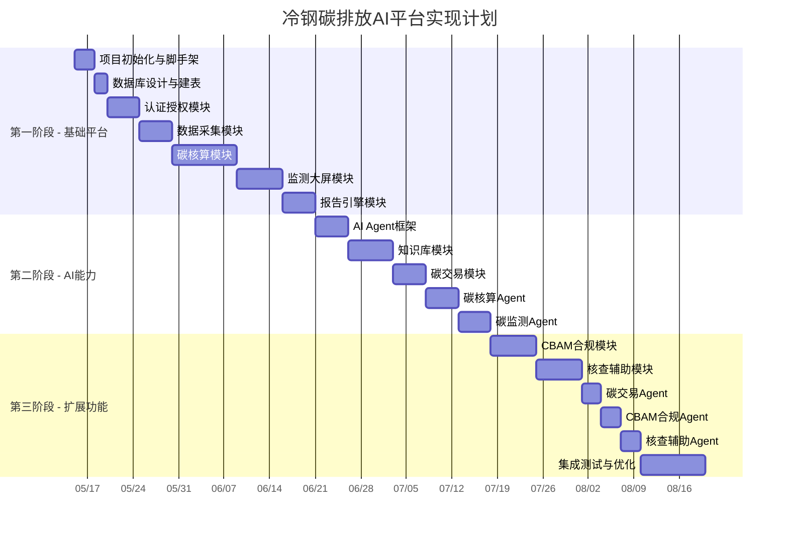

### 6.2 文件清单

#### 6.2.1 后端项目结构

```
carbon-platform/
├── docker-compose.yml
├── .env.example
├── nginx/
│   └── nginx.conf
│
├── packages/
│   ├── shared/                          # 共享类型和工具
│   │   ├── src/
│   │   │   ├── types/
│   │   │   │   ├── activity-data.ts     # 活动数据类型
│   │   │   │   ├── emission.ts          # 排放相关类型
│   │   │   │   ├── quota.ts             # 配额类型
│   │   │   │   ├── alert.ts             # 预警类型
│   │   │   │   ├── report.ts            # 报告类型
│   │   │   │   └── user.ts              # 用户类型
│   │   │   ├── constants/
│   │   │   │   ├── emission-factors.ts  # 排放因子常量
│   │   │   │   ├── roles.ts             # 角色权限常量
│   │   │   │   └── error-codes.ts       # 错误码
│   │   │   └── utils/
│   │   │       ├── validator.ts         # 数据校验工具
│   │   │       └── formatter.ts         # 格式化工具
│   │   ├── package.json
│   │   └── tsconfig.json
│   │
│   ├── auth-service/                    # 认证服务
│   │   ├── src/
│   │   │   ├── controllers/
│   │   │   │   └── auth.controller.ts
│   │   │   ├── services/
│   │   │   │   ├── auth.service.ts
│   │   │   │   └── jwt.service.ts
│   │   │   ├── middleware/
│   │   │   │   ├── auth.middleware.ts
│   │   │   │   └── rbac.middleware.ts
│   │   │   ├── routes/
│   │   │   │   └── auth.routes.ts
│   │   │   └── app.ts
│   │   ├── package.json
│   │   └── Dockerfile
│   │
│   ├── carbon-service/                  # 碳核算服务
│   │   ├── src/
│   │   │   ├── controllers/
│   │   │   │   ├── activity-data.controller.ts
│   │   │   │   ├── emission-factor.controller.ts
│   │   │   │   └── emission-result.controller.ts
│   │   │   ├── services/
│   │   │   │   ├── activity-data.service.ts
│   │   │   │   ├── emission-factor.service.ts
│   │   │   │   └── calculation.service.ts
│   │   │   ├── engine/
│   │   │   │   ├── fuel-calculator.ts     # 燃料排放计算
│   │   │   │   ├── process-calculator.ts  # 过程排放计算
│   │   │   │   └── electricity-calculator.ts # 电力排放计算
│   │   │   ├── import/
│   │   │   │   ├── excel-parser.ts        # Excel解析
│   │   │   │   ├── data-validator.ts      # 数据校验
│   │   │   │   └── templates/             # Excel模板
│   │   │   ├── routes/
│   │   │   │   └── carbon.routes.ts
│   │   │   └── app.ts
│   │   ├── package.json
│   │   └── Dockerfile
│   │
│   ├── monitor-service/                 # 碳监测服务
│   │   ├── src/
│   │   │   ├── controllers/
│   │   │   │   ├── dashboard.controller.ts
│   │   │   │   ├── realtime.controller.ts
│   │   │   │   └── alert.controller.ts
│   │   │   ├── services/
│   │   │   │   ├── dashboard.service.ts
│   │   │   │   ├── realtime.service.ts
│   │   │   │   └── alert.service.ts
│   │   │   ├── rules/
│   │   │   │   ├── threshold-rule.ts     # 阈值规则
│   │   │   │   ├── trend-rule.ts         # 趋势规则
│   │   │   │   ├── yoy-rule.ts           # 同比规则
│   │   │   │   └── rule-engine.ts        # 规则引擎
│   │   │   ├── websocket/
│   │   │   │   └── monitor-ws.ts         # WebSocket推送
│   │   │   ├── routes/
│   │   │   │   └── monitor.routes.ts
│   │   │   └── app.ts
│   │   ├── package.json
│   │   └── Dockerfile
│   │
│   ├── trade-service/                   # 碳交易服务
│   │   ├── src/
│   │   │   ├── controllers/
│   │   │   │   ├── quota.controller.ts
│   │   │   │   ├── compliance.controller.ts
│   │   │   │   └── price.controller.ts
│   │   │   ├── services/
│   │   │   │   ├── quota.service.ts
│   │   │   │   ├── compliance.service.ts
│   │   │   │   └── price.service.ts
│   │   │   ├── routes/
│   │   │   │   └── trade.routes.ts
│   │   │   └── app.ts
│   │   ├── package.json
│   │   └── Dockerfile
│   │
│   ├── cbam-service/                    # CBAM合规服务
│   │   ├── src/
│   │   │   ├── controllers/
│   │   │   │   ├── rule.controller.ts
│   │   │   │   ├── calculation.controller.ts
│   │   │   │   └── declaration.controller.ts
│   │   │   ├── services/
│   │   │   │   ├── rule.service.ts
│   │   │   │   ├── embedded-carbon.service.ts
│   │   │   │   └── declaration.service.ts
│   │   │   ├── engine/
│   │   │   │   └── cbam-calculator.ts    # CBAM隐含碳计算
│   │   │   ├── routes/
│   │   │   │   └── cbam.routes.ts
│   │   │   └── app.ts
│   │   ├── package.json
│   │   └── Dockerfile
│   │
│   ├── verify-service/                  # 核查辅助服务
│   │   ├── src/
│   │   │   ├── controllers/
│   │   │   │   ├── mrv.controller.ts
│   │   │   │   ├── preaudit.controller.ts
│   │   │   │   └── material.controller.ts
│   │   │   ├── services/
│   │   │   │   ├── mrv-check.service.ts
│   │   │   │   ├── preaudit.service.ts
│   │   │   │   └── material.service.ts
│   │   │   ├── checker/
│   │   │   │   ├── completeness-checker.ts
│   │   │   │   ├── consistency-checker.ts
│   │   │   │   └── logic-checker.ts
│   │   │   ├── routes/
│   │   │   │   └── verify.routes.ts
│   │   │   └── app.ts
│   │   ├── package.json
│   │   └── Dockerfile
│   │
│   ├── knowledge-service/               # 知识库服务
│   │   ├── src/
│   │   │   ├── controllers/
│   │   │   │   ├── document.controller.ts
│   │   │   │   └── qa.controller.ts
│   │   │   ├── services/
│   │   │   │   ├── document.service.ts
│   │   │   │   ├── embedding.service.ts
│   │   │   │   └── qa.service.ts
│   │   │   ├── routes/
│   │   │   │   └── knowledge.routes.ts
│   │   │   └── app.ts
│   │   ├── package.json
│   │   └── Dockerfile
│   │
│   ├── report-service/                  # 报告服务
│   │   ├── src/
│   │   │   ├── controllers/
│   │   │   │   └── report.controller.ts
│   │   │   ├── services/
│   │   │   │   ├── report.service.ts
│   │   │   │   └── pdf-generator.ts
│   │   │   ├── templates/
│   │   │   │   ├── monthly-report.html   # 月度报告模板
│   │   │   │   └── annual-report.html    # 年度报告模板
│   │   │   ├── routes/
│   │   │   │   └── report.routes.ts
│   │   │   └── app.ts
│   │   ├── package.json
│   │   └── Dockerfile
│   │
│   ├── system-service/                  # 系统管理服务
│   │   ├── src/
│   │   │   ├── controllers/
│   │   │   │   ├── user.controller.ts
│   │   │   │   ├── role.controller.ts
│   │   │   │   └── audit.controller.ts
│   │   │   ├── services/
│   │   │   │   ├── user.service.ts
│   │   │   │   ├── role.service.ts
│   │   │   │   └── audit.service.ts
│   │   │   ├── routes/
│   │   │   │   └── system.routes.ts
│   │   │   └── app.ts
│   │   ├── package.json
│   │   └── Dockerfile
│   │
│   └── api-gateway/                     # API网关
│       ├── src/
│       │   ├── middleware/
│       │   │   ├── auth.ts
│       │   │   ├── rate-limit.ts
│       │   │   └── logger.ts
│       │   ├── routes/
│       │   │   └── proxy.ts
│       │   └── app.ts
│       ├── package.json
│       └── Dockerfile
│
├── ai-agent/                            # AI智能体服务(Python)
│   ├── pyproject.toml
│   ├── app/
│   │   ├── main.py                      # FastAPI入口
│   │   ├── core/
│   │   │   ├── config.py                # 配置
│   │   │   ├── orchestrator.py          # Agent编排引擎
│   │   │   ├── memory.py                # 记忆管理
│   │   │   └── tool_registry.py         # 工具注册
│   │   ├── agents/
│   │   │   ├── base_agent.py            # Agent基类
│   │   │   ├── carbon_accounting.py     # 碳核算Agent
│   │   │   ├── carbon_monitor.py        # 碳监测Agent
│   │   │   ├── carbon_trade.py          # 碳交易Agent
│   │   │   ├── cbam_compliance.py       # CBAM合规Agent
│   │   │   ├── verification.py          # 核查辅助Agent
│   │   │   └── knowledge_base.py        # 知识库Agent
│   │   ├── tools/
│   │   │   ├── data_query.py            # 数据查询工具
│   │   │   ├── carbon_calculator.py    # 碳排放计算工具
│   │   │   ├── report_generator.py      # 报告生成工具
│   │   │   ├── knowledge_search.py      # 知识检索工具
│   │   │   ├── alert_notifier.py        # 预警通知工具
│   │   │   └── file_exporter.py         # 文件导出工具
│   │   ├── rag/
│   │   │   ├── document_loader.py       # 文档加载
│   │   │   ├── text_splitter.py         # 文本分割
│   │   │   ├── embedding.py             # 向量化
│   │   │   ├── vector_store.py          # 向量存储
│   │   │   └── retriever.py             # 检索器
│   │   └── api/
│   │       ├── agent.py                 # Agent API
│   │       └── chat.py                  # 对话API
│   ├── Dockerfile
│   └── requirements.txt
│
└── frontend/                            # 前端项目
    ├── package.json
    ├── vite.config.ts
    ├── tailwind.config.js
    ├── tsconfig.json
    ├── index.html
    ├── public/
    │   └── favicon.ico
    └── src/
        ├── main.tsx
        ├── App.tsx
        ├── router/
        │   └── index.tsx                 # 路由配置
        ├── layouts/
        │   ├── MainLayout.tsx            # 主布局(侧边栏+顶栏)
        │   └── AuthLayout.tsx            # 登录布局
        ├── pages/
        │   ├── Login/
        │   │   └── index.tsx
        │   ├── Dashboard/
        │   │   └── index.tsx             # 首页仪表盘
        │   ├── CarbonAccounting/
        │   │   ├── ActivityData/         # 数据采集
        │   │   ├── EmissionFactor/       # 排放因子
        │   │   ├── EmissionResult/       # 核算结果
        │   │   └── ReportManage/         # 报告管理
        │   ├── CarbonMonitor/
        │   │   ├── DashboardScreen/     # 监控大屏
        │   │   ├── ProcessMonitor/       # 工序监控
        │   │   └── AlertManage/          # 异常预警
        │   ├── CarbonTrade/
        │   │   ├── QuotaManage/          # 配额管理
        │   │   ├── ComplianceTrack/      # 履约跟踪
        │   │   ├── CarbonPrice/          # 碳价行情
        │   │   └── TradeRecord/          # 交易记录
        │   ├── CBAM/
        │   │   ├── RuleInterpret/        # 规则解读
        │   │   ├── EmbeddedCarbon/       # 隐含碳计算
        │   │   ├── ExportManage/         # 出口管理
        │   │   └── Declaration/          # 申报管理
        │   ├── Verification/
        │   │   ├── MRVCheck/             # MRV检查
        │   │   ├── DataPreAudit/         # 数据预审
        │   │   ├── MaterialPackage/      # 资料包生成
        │   │   └── VerifyQA/            # 核查问答
        │   ├── KnowledgeBase/
        │   │   ├── SmartQA/              # 智能问答
        │   │   ├── PolicyRegulation/     # 政策法规
        │   │   ├── StandardSpec/         # 标准规范
        │   │   └── IndustryGuide/        # 行业指南
        │   └── SystemManage/
        │       ├── UserManage/           # 用户管理
        │       ├── RolePermission/       # 角色权限
        │       ├── DataDict/             # 数据字典
        │       └── AuditLog/             # 审计日志
        ├── components/
        │   ├── common/
        │   │   ├── DataTable.tsx         # 通用数据表格
        │   │   ├── SearchForm.tsx        # 搜索表单
        │   │   ├── FileUpload.tsx        # 文件上传
        │   │   └── StatusBadge.tsx       # 状态标签
        │   ├── charts/
        │   │   ├── LineChart.tsx         # 折线图
        │   │   ├── BarChart.tsx          # 柱状图
        │   │   ├── PieChart.tsx          # 饼图
        │   │   └── GaugeChart.tsx        # 仪表盘
        │   ├── dashboard/
        │   │   ├── StatCard.tsx         # 统计卡片
        │   │   ├── TrendCard.tsx        # 趋势卡片
        │   │   └── AlertList.tsx         # 预警列表
        │   └── carbon/
        │       ├── EmissionTable.tsx     # 排放数据表
        │       ├── FactorSelector.tsx    # 因子选择器
        │       └── CalculationDetail.tsx # 计算明细
        ├── hooks/
        │   ├── useAuth.ts               # 认证Hook
        │   ├── usePagination.ts         # 分页Hook
        │   └── useWebSocket.ts          # WebSocket Hook
        ├── services/
        │   ├── api.ts                   # API基础配置
        │   ├── auth.ts                  # 认证API
        │   ├── carbon.ts                # 碳核算API
        │   ├── monitor.ts              # 碳监测API
        │   ├── trade.ts                # 碳交易API
        │   ├── cbam.ts                 # CBAM API
        │   ├── verify.ts               # 核查API
        │   ├── knowledge.ts            # 知识库API
        │   └── system.ts               # 系统管理API
        ├── store/
        │   ├── authStore.ts            # 认证状态
        │   └── appStore.ts             # 应用状态
        ├── utils/
        │   ├── format.ts              # 格式化工具
        │   └── validator.ts            # 校验工具
        └── styles/
            └── theme.ts                # MUI主题配置
```

### 6.3 依赖关系图

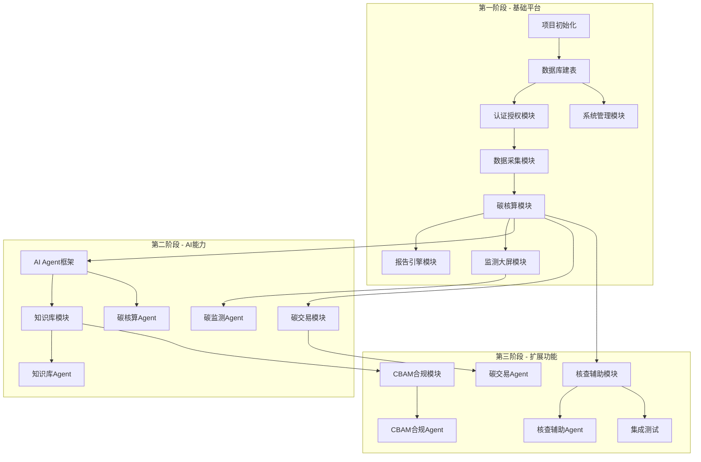

---

## 7. 部署架构

### 7.1 容器化方案

#### 7.1.1 Docker Compose配置

```yaml
# docker-compose.yml
version: '3.8'

services:
  # 前端应用
  frontend:
    build:
      context: ./frontend
      dockerfile: Dockerfile
    ports:
      - "3000:80"
    depends_on:
      - api-gateway
    restart: unless-stopped

  # API网关
  api-gateway:
    build:
      context: ./packages/api-gateway
      dockerfile: Dockerfile
    ports:
      - "8080:8080"
    environment:
      - AUTH_SERVICE_URL=http://auth-service:3001
      - CARBON_SERVICE_URL=http://carbon-service:3002
      - MONITOR_SERVICE_URL=http://monitor-service:3003
      - TRADE_SERVICE_URL=http://trade-service:3004
      - CBAM_SERVICE_URL=http://cbam-service:3005
      - VERIFY_SERVICE_URL=http://verify-service:3006
      - KNOWLEDGE_SERVICE_URL=http://knowledge-service:3007
      - REPORT_SERVICE_URL=http://report-service:3008
      - SYSTEM_SERVICE_URL=http://system-service:3009
      - AGENT_SERVICE_URL=http://ai-agent:8000
    depends_on:
      - auth-service
      - carbon-service
      - monitor-service
    restart: unless-stopped

  # 认证服务
  auth-service:
    build:
      context: ./packages/auth-service
      dockerfile: Dockerfile
    environment:
      - DB_HOST=mysql
      - DB_PORT=3306
      - DB_NAME=carbon_main
      - DB_USER=carbon
      - DB_PASSWORD=${DB_PASSWORD}
      - REDIS_URL=redis://redis:6379
      - JWT_SECRET=${JWT_SECRET}
    depends_on:
      - mysql
      - redis
    restart: unless-stopped

  # 碳核算服务
  carbon-service:
    build:
      context: ./packages/carbon-service
      dockerfile: Dockerfile
    environment:
      - DB_HOST=mysql
      - DB_PORT=3306
      - DB_NAME=carbon_main
      - DB_USER=carbon
      - DB_PASSWORD=${DB_PASSWORD}
      - REDIS_URL=redis://redis:6379
      - MINIO_ENDPOINT=minio
      - MINIO_ACCESS_KEY=${MINIO_ACCESS_KEY}
      - MINIO_SECRET_KEY=${MINIO_SECRET_KEY}
    depends_on:
      - mysql
      - redis
      - minio
    restart: unless-stopped

  # 碳监测服务
  monitor-service:
    build:
      context: ./packages/monitor-service
      dockerfile: Dockerfile
    environment:
      - DB_HOST=mysql
      - DB_PORT=3306
      - DB_NAME=carbon_main
      - DB_USER=carbon
      - DB_PASSWORD=${DB_PASSWORD}
      - REDIS_URL=redis://redis:6379
    depends_on:
      - mysql
      - redis
    restart: unless-stopped

  # 碳交易服务
  trade-service:
    build:
      context: ./packages/trade-service
      dockerfile: Dockerfile
    environment:
      - DB_HOST=mysql
      - DB_PORT=3306
      - DB_NAME=carbon_main
      - DB_USER=carbon
      - DB_PASSWORD=${DB_PASSWORD}
    depends_on:
      - mysql
    restart: unless-stopped

  # CBAM合规服务
  cbam-service:
    build:
      context: ./packages/cbam-service
      dockerfile: Dockerfile
    environment:
      - DB_HOST=mysql
      - DB_PORT=3306
      - DB_NAME=carbon_main
      - DB_USER=carbon
      - DB_PASSWORD=${DB_PASSWORD}
    depends_on:
      - mysql
    restart: unless-stopped

  # 核查辅助服务
  verify-service:
    build:
      context: ./packages/verify-service
      dockerfile: Dockerfile
    environment:
      - DB_HOST=mysql
      - DB_PORT=3306
      - DB_NAME=carbon_main
      - DB_USER=carbon
      - DB_PASSWORD=${DB_PASSWORD}
      - MINIO_ENDPOINT=minio
      - MINIO_ACCESS_KEY=${MINIO_ACCESS_KEY}
      - MINIO_SECRET_KEY=${MINIO_SECRET_KEY}
    depends_on:
      - mysql
      - minio
    restart: unless-stopped

  # 知识库服务
  knowledge-service:
    build:
      context: ./packages/knowledge-service
      dockerfile: Dockerfile
    environment:
      - MONGO_URI=mongodb://mongo:27017/carbon_knowledge
      - MINIO_ENDPOINT=minio
      - MINIO_ACCESS_KEY=${MINIO_ACCESS_KEY}
      - MINIO_SECRET_KEY=${MINIO_SECRET_KEY}
    depends_on:
      - mongo
      - minio
    restart: unless-stopped

  # 报告服务
  report-service:
    build:
      context: ./packages/report-service
      dockerfile: Dockerfile
    environment:
      - DB_HOST=mysql
      - DB_PORT=3306
      - DB_NAME=carbon_report
      - DB_USER=carbon
      - DB_PASSWORD=${DB_PASSWORD}
      - MINIO_ENDPOINT=minio
      - MINIO_ACCESS_KEY=${MINIO_ACCESS_KEY}
      - MINIO_SECRET_KEY=${MINIO_SECRET_KEY}
    depends_on:
      - mysql
      - minio
    restart: unless-stopped

  # 系统管理服务
  system-service:
    build:
      context: ./packages/system-service
      dockerfile: Dockerfile
    environment:
      - DB_HOST=mysql
      - DB_PORT=3306
      - DB_NAME=carbon_main
      - DB_USER=carbon
      - DB_PASSWORD=${DB_PASSWORD}
      - MONGO_URI=mongodb://mongo:27017/carbon_knowledge
    depends_on:
      - mysql
      - mongo
    restart: unless-stopped

  # AI智能体服务
  ai-agent:
    build:
      context: ./ai-agent
      dockerfile: Dockerfile
    environment:
      - OPENAI_API_KEY=${OPENAI_API_KEY}
      - LLM_MODEL=${LLM_MODEL:-gpt-4}
      - EMBEDDING_MODEL=${EMBEDDING_MODEL:-text-embedding-3-small}
      - MONGO_URI=mongodb://mongo:27017/carbon_knowledge
      - CARBON_SERVICE_URL=http://carbon-service:3002
      - MONITOR_SERVICE_URL=http://monitor-service:3003
    depends_on:
      - mongo
    restart: unless-stopped

  # MySQL数据库
  mysql:
    image: mysql:8.0
    ports:
      - "3306:3306"
    environment:
      - MYSQL_ROOT_PASSWORD=${MYSQL_ROOT_PASSWORD}
      - MYSQL_DATABASE=carbon_main
      - MYSQL_USER=carbon
      - MYSQL_PASSWORD=${DB_PASSWORD}
    volumes:
      - mysql_data:/var/lib/mysql
      - ./init-sql:/docker-entrypoint-initdb.d
    restart: unless-stopped

  # Redis缓存
  redis:
    image: redis:7.0-alpine
    ports:
      - "6379:6379"
    volumes:
      - redis_data:/data
    restart: unless-stopped

  # MongoDB文档数据库
  mongo:
    image: mongo:7.0
    ports:
      - "27017:27017"
    environment:
      - MONGO_INITDB_ROOT_USERNAME=${MONGO_USER}
      - MONGO_INITDB_ROOT_PASSWORD=${MONGO_PASSWORD}
    volumes:
      - mongo_data:/data/db
    restart: unless-stopped

  # MinIO对象存储
  minio:
    image: minio/minio:latest
    ports:
      - "9000:9000"
      - "9001:9001"
    environment:
      - MINIO_ROOT_USER=${MINIO_ACCESS_KEY}
      - MINIO_ROOT_PASSWORD=${MINIO_SECRET_KEY}
    volumes:
      - minio_data:/data
    command: server /data --console-address ":9001"
    restart: unless-stopped

volumes:
  mysql_data:
  redis_data:
  mongo_data:
  minio_data:
```

### 7.2 环境配置

#### 7.2.1 .env.example

```bash
# 数据库配置
MYSQL_ROOT_PASSWORD=root_password_here
DB_PASSWORD=carbon_password_here

# MongoDB配置
MONGO_USER=carbon
MONGO_PASSWORD=mongo_password_here

# Redis配置
REDIS_PASSWORD=redis_password_here

# MinIO配置
MINIO_ACCESS_KEY=minioadmin
MINIO_SECRET_KEY=minio_secret_here

# JWT配置
JWT_SECRET=jwt_secret_key_here_at_least_32_chars
JWT_EXPIRES_IN=86400

# AI模型配置
OPENAI_API_KEY=sk-your-api-key-here
LLM_MODEL=gpt-4
EMBEDDING_MODEL=text-embedding-3-small

# 碳市场API（预留）
CARBON_MARKET_API_KEY=
CARBON_MARKET_API_URL=

# 应用配置
NODE_ENV=production
LOG_LEVEL=info
```

#### 7.2.2 资源需求

| 服务 | CPU | 内存 | 磁盘 | 实例数 |
|------|-----|------|------|--------|
| frontend | 0.5核 | 512MB | 1GB | 1 |
| api-gateway | 1核 | 1GB | 5GB | 1 |
| auth-service | 0.5核 | 512MB | 5GB | 1 |
| carbon-service | 1核 | 1GB | 5GB | 1 |
| monitor-service | 1核 | 1GB | 5GB | 1 |
| trade-service | 0.5核 | 512MB | 5GB | 1 |
| cbam-service | 0.5核 | 512MB | 5GB | 1 |
| verify-service | 0.5核 | 512MB | 5GB | 1 |
| knowledge-service | 1核 | 1GB | 5GB | 1 |
| report-service | 1核 | 1GB | 5GB | 1 |
| system-service | 0.5核 | 512MB | 5GB | 1 |
| ai-agent | 2核 | 4GB | 10GB | 1 |
| mysql | 2核 | 4GB | 50GB | 1 |
| redis | 1核 | 2GB | 10GB | 1 |
| mongo | 2核 | 4GB | 50GB | 1 |
| minio | 1核 | 1GB | 100GB | 1 |
| **合计** | **16核** | **24GB** | **271GB** | **17** |

---

## 8. 关键技术方案

### 8.1 碳核算算法

#### 8.1.1 化石燃料燃烧排放计算

依据GB/T 32150-2025标准，采用排放因子法：

```
E_fuel = Σ(E_i)

其中每种燃料：
E_i = AD_i × NCV_i × CC_i × OF_i × (44/12)

参数说明：
- AD_i: 第i种燃料消耗量（吨/万m³）
- NCV_i: 第i种燃料低位发热量（TJ/万吨 或 TJ/万m³）
- CC_i: 第i种燃料含碳量（tc/TJ）
- OF_i: 第i种燃料氧化率（%）
- 44/12: CO₂与C的分子量之比

示例（焦炭）：
AD = 775,092.54 吨
NCV = 28.435 TJ/万吨 (默认值)
CC = 26.18 tc/TJ (默认值)
OF = 0.988 (默认值)

E_焦炭 = 775092.54 × (28.435/10000) × 26.18 × 0.988 × (44/12)
       ≈ 2,103,498 tCO₂
```

#### 8.1.2 过程排放计算

```
E_process = Σ(AD_j × EF_j)

主要过程排放源：
- 石灰石分解：CaCO₃ → CaO + CO₂
  EF = 0.4397 tCO₂/t石灰石
- 白云石分解：CaCO₃·MgCO₃ → CaO·MgO + 2CO₂
  EF = 0.4743 tCO₂/t白云石
- 炼钢降碳：根据生铁含碳量与钢水含碳量差值计算
```

#### 8.1.3 净购入电力排放计算

```
E_electricity = AD_电力 × EF_电网

AD_电力 = 净购入电量（万kWh）
EF_电网 = 区域电网排放因子（tCO₂/MWh）

示例：
AD = 79,655.58 万kWh
EF = 0.5810 tCO₂/MWh (华中区域电网2025年度排放因子)

E_电力 = 79655.58 × 10 × 0.5810 × 0.001
       ≈ 193,859 tCO₂
```

#### 8.1.4 工序级碳排放分解

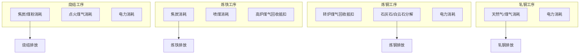

分解规则：
1. 燃料消耗按工序设备归属分配
2. 电力按各工序电表数据分配
3. 过程排放按排放源所在工序归属
4. 煤气回收作为负排放计入对应工序

### 8.2 数据采集方案

#### 8.2.1 Excel模板导入方案

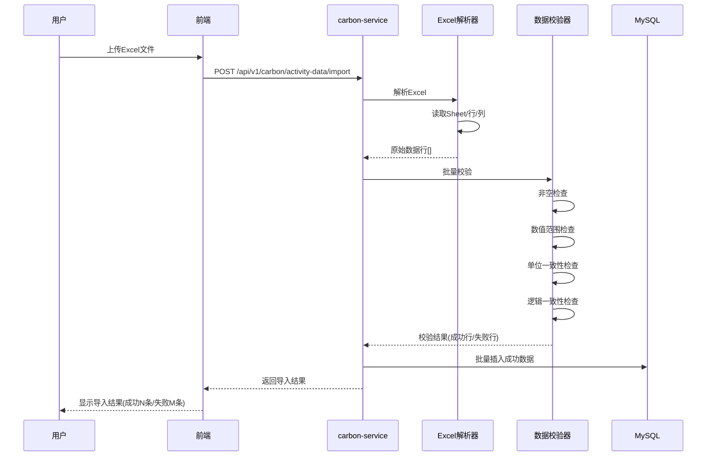

**Excel模板格式**：
| 列 | 名称 | 说明 |
|----|------|------|
| A | 参数代码 | 如 AL-1, AL-2 |
| B | 参数名称 | 如 焦炭消耗量 |
| C | 工序 | 烧结/炼铁/炼钢/轧钢/全厂 |
| D | 数值 | 数据值 |
| E | 单位 | 吨/万m³/万kWh |
| F | 数据来源 | 手工/计量/结算 |
| G | 备注 | 可选 |

**校验规则**：
- 参数代码必须匹配预定义列表
- 数值必须为正数，且在合理范围内
- 单位必须与参数代码对应的默认单位一致
- 同一工序同月同一参数不能重复

#### 8.2.2 外部系统对接方案

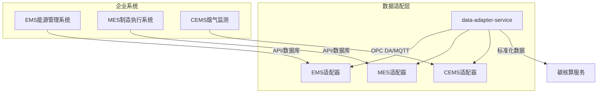

**适配器设计**：
- 统一接口：`IDataAdapter`，定义 `fetchData(type, period)` 方法
- 每个外部系统实现独立适配器
- 数据转换层：将外部系统数据格式转换为平台标准格式
- 异步采集：定时任务自动拉取，失败自动重试
- 降级策略：外部系统不可用时，回退到手动导入

### 8.3 安全方案

#### 8.3.1 认证与授权

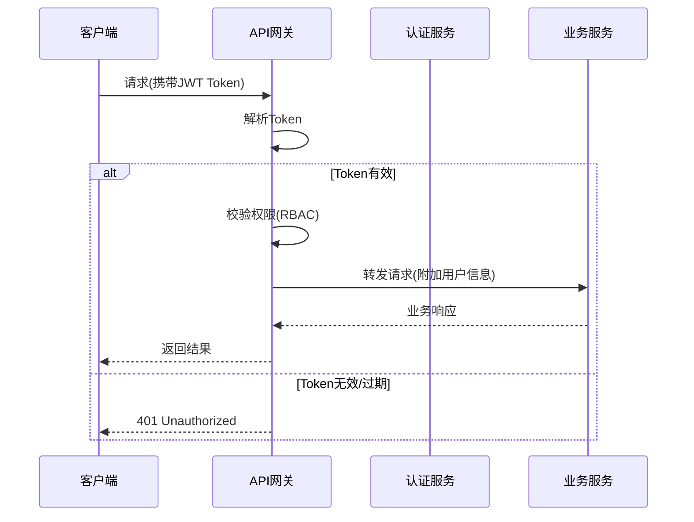

**JWT Token结构**：
```json
{
  "sub": "user_id",
  "username": "zhangsan",
  "roles": ["carbon_manager"],
  "permissions": ["carbon:read", "carbon:write"],
  "iat": 1718000000,
  "exp": 1718086400
}
```

**RBAC权限矩阵**：

| 资源 | 系统管理员 | 碳管理主管 | 能源统计员 | 生产调度 | 财务人员 | 只读用户 |
|------|-----------|-----------|-----------|---------|---------|---------|
| 碳核算-查看 | ✓ | ✓ | ✓ | ✓ | - | ✓ |
| 碳核算-编辑 | ✓ | ✓ | ✓ | - | - | - |
| 碳核算-审批 | ✓ | ✓ | - | - | - | - |
| 碳监测-查看 | ✓ | ✓ | ✓ | ✓ | - | ✓ |
| 预警-处置 | ✓ | ✓ | - | ✓ | - | - |
| 碳交易-查看 | ✓ | ✓ | - | - | ✓ | ✓ |
| 碳交易-编辑 | ✓ | ✓ | - | - | ✓ | - |
| CBAM-查看 | ✓ | ✓ | - | - | - | ✓ |
| CBAM-编辑 | ✓ | ✓ | - | - | - | - |
| 知识库-问答 | ✓ | ✓ | ✓ | ✓ | ✓ | ✓ |
| 系统管理 | ✓ | - | - | - | - | - |

#### 8.3.2 数据安全

| 安全措施 | 实现方案 |
|---------|---------|
| 传输加密 | 全站HTTPS (TLS 1.2+)，HSTS Header |
| 密码存储 | bcrypt哈希，salt rounds=12 |
| 敏感数据加密 | AES-256-GCM加密配额价格等敏感字段 |
| SQL注入防护 | 参数化查询(Sequelize/Knex) |
| XSS防护 | 输出编码 + CSP Header + HttpOnly Cookie |
| CSRF防护 | SameSite Cookie + CSRF Token |
| 文件上传 | 白名单(.xlsx/.xls/.pdf/.docx) + 大小限制(50MB) + 病毒扫描 |
| 日志审计 | 关键操作写入审计日志(MongoDB)，不可修改 |
| 数据备份 | MySQL每日全量备份，保留3年；MongoDB OpLog增量备份 |

#### 8.3.3 API限流策略

| 接口类型 | 限流规则 |
|---------|---------|
| 认证接口 | 同一IP 5次/分钟 |
| 普通查询 | 同一用户 60次/分钟 |
| 数据导入 | 同一用户 10次/分钟 |
| AI问答 | 同一用户 20次/分钟 |
| 报告生成 | 同一用户 5次/分钟 |

---

*文档结束*
